# Patterns In Music by Genre
##### A Data Visualization by Tyler Straub

## Some Preamble
  Everyone has prejudices against certain genres of music. Rap is all about drugs and sex! Metal is damaging to the youth! Pop is repetitive trash! But how true are these prejudices? To find out, I looked at some of the more popular songs today from various genres and sifted through the data to find out what trends appear in the lyrics of music today.

## How the Heck Are We Gonna Do This?
  Spotify compiles semi-frequently updated playlists for music of various genres on their app and allows the public to listen to them, so we are going to use this to our advantage to get our song data. Rspotify is a nice package that makes accessing the Spotify API through R easy to do. To get the actual lyric data, we will scrape data from Genius, a website that not only displays lyrics, but allows users to contribute annotations explaining the meaning behind certain lyrics. The package geniusR also acts as a middleman for the Genius API, making our life a little easier.
  
## Let's Get A List of Songs
There is no particular reason why, but the seven genres we'll be looking at are Rap, Pop, RNB, Country, Classic Rock, Metal, and Rock. The inclusion of classic rock is a little redundant with rock, but since it's such a different era, it is interesting to look at nonetheless. Here are the corresponding Spotify playlists with each of these genres:

- Rap: Rap Caviar
- Pop: Today's top hits
- RnB: Are & Be
- Country: Hot Country
- Classic Rock: Rock Classics
- Metal: Metal Essentials
- Rock: Rock This

There are some important things to note about these playlists. For starters, "Today's Top Hits" will have some overlap since it's not specifically pop, and there may especially be overlap with Rap Caviar. However, with rap being the most popular genre in 2018, it makes sense that a lot of the most popular songs may have a rap feature in the song.

## Some Code

Here is the only place where we use the Rspotify package. We will use the "getPlaylistSongs" function, which uses the Spotify URI from each playlist to grab song info for every track in the playlist.

NOTE: The following code (and a lot of the code in this project) is horribly redundant, inefficient, and quite frankly disgusting. Proceed at your own risk.

```
# this should really be in only one data frame to make life easier
topRap <- getPlaylistSongs("Spotify", "37i9dQZF1DX0XUsuxWHRQd", token = spotifyKeys)
topPop <- getPlaylistSongs("Spotify", "37i9dQZF1DXcBWIGoYBM5M", token = spotifyKeys)
topRnB <- getPlaylistSongs("Spotify", "37i9dQZF1DX4SBhb3fqCJd", token = spotifyKeys)
topCountry <- getPlaylistSongs("Spotify", "37i9dQZF1DX1lVhptIYRda", token = spotifyKeys)
topClassicRock <- getPlaylistSongs("Spotify", "37i9dQZF1DWXRqgorJj26U", token = spotifyKeys)
topMetal <- getPlaylistSongs("Spotify", "37i9dQZF1DWWOaP4H0w5b0", token = spotifyKeys)
topRock <- getPlaylistSongs("Spotify", "37i9dQZF1DXcF6B6QPhFDv", token = spotifyKeys)

# clean up data so that it will be fed into genius
# remove anything in parentheses to get rid of (feat. ...)
topRap$tracks <- str_replace(topRap$tracks, " \\(.*\\)", "")
topPop$tracks <- str_replace(topPop$tracks, " \\(.*\\)", "")
topRnB$tracks <- str_replace(topRnB$tracks, " \\(.*\\)", "")
topCountry$tracks <- str_replace(topCountry$tracks, " \\(.*\\)", "")
topClassicRock$tracks <- str_replace(topClassicRock$tracks, " \\(.*\\)", "")
topMetal$tracks <- str_replace(topMetal$tracks, " \\(.*\\)", "")
topRock$tracks <- str_replace(topRock$tracks, " \\(.*\\)", "")
```

Here is a brief look at the head of the topRap table:

|      |tracks         |id                    |popularity |artist                |artist_full             |artistId              |album                   |
|------|---------------|----------------------|-----------|----------------------|------------------------|----------------------|-------------------------|
|1     |Wow.           |6MWtB6iiXyIwun0YzU6DFP|         95|Post Malone           |Post Malone             |246dkjvS1zLTtiykXe5h60|Wow.                    |
|2     |Going  Bad     |2IRZnDFmlqMuOrYOLnZZyc|         94|Meek Mill             |Meek Mill feat. Drake   |20sxb77xiYeusSH8cVdatc|Championships           |
|3     |Space Cadet    |5gub2bpJRgJP4m4MliqtdV|         65|Metro Boomin          |Metro Boomin feat. Gunna|0iEtIxbK0KxaSlF7G42ZOp|NOT ALL HEROES WEAR CAPES|
|4     |Butterfly Doors|4NdXQlDTzxbOMkzJGWFtz3|         81|Lil Pump              |Lil Pump                |3wyVrVrFCkukjdVIdirGVY|Butterfly Doors         |
|5     |Look Back At It|3J5YrOvX2A0EA0j4BARQ9o|         83|A Boogie Wit da Hoodie|A Boogie Wit da Hoodie  |31W5EY0aAly4Qieq6OFu6I|Look Back At It         |
|6     |Drip Too Hard  |1BxkZE73h9BN3qwuA15TA3|         90|Lil Baby              |Lil Baby feat. Gunna    |5f7VJjfbwm532GiveGC0ZK|Drip Too Hard           |

Now that we have a dataset of songs to choose from, we can scrape the lyrics from them using the geniusR package. The add_genius function lets us scrape the data from a list of songs rather than having to individually specify each song name and artist name.

```
rapLyrics <- add_genius(topRap, artist, tracks, type = "lyrics")
popLyrics <- add_genius(topPop, artist, tracks, type = "lyrics")
rnbLyrics <- add_genius(topRnB, artist, tracks, type = "lyrics")
countryLyrics <- add_genius(topCountry, artist, tracks, type = "lyrics")
classicRockLyrics <- add_genius(topClassicRock, artist, tracks, type = "lyrics")
metalLyrics <- add_genius(topMetal, artist, tracks, type = "lyrics")
rockLyrics <- add_genius(topRock, artist, tracks, type = "lyrics")
```

Here is a tibble of the rap lyrics:

| |tracks|artist  |id         |popularity|artist_full|artistId    |album|albumId    |track_title|line|lyric            |            
|-|------|--------|-----------|----------|-----------|------------|-----|-----------|-----------|----|-----------------|
|1|Wow.  |Post Ma…|6MWtB6iiXy…|        95|Post Malone|246dkjvS1zL…|Wow. |5Dcz8PZHKu…|Wow.       |   1|Said she tired o…|
|2|Wow.  |Post Ma…|6MWtB6iiXy…|        95|Post Malone|246dkjvS1zL…|Wow. |5Dcz8PZHKu…|Wow.       |   2|Pull up 20 inch …|
|3|Wow.  |Post Ma…|6MWtB6iiXy…|        95|Post Malone|246dkjvS1zL…|Wow. |5Dcz8PZHKu…|Wow.       |   3|Now it's everybo…|
|4|Wow.  |Post Ma…|6MWtB6iiXy…|        95|Post Malone|246dkjvS1zL…|Wow. |5Dcz8PZHKu…|Wow.       |   4|Shawty mixing up…|
|5|Wow.  |Post Ma…|6MWtB6iiXy…|        95|Post Malone|246dkjvS1zL…|Wow. |5Dcz8PZHKu…|Wow.       |   5|G-Wagen, G-Wagen…|
|6|Wow.  |Post Ma…|6MWtB6iiXy…|        95|Post Malone|246dkjvS1zL…|Wow. |5Dcz8PZHKu…|Wow.       |   6|All the housewiv…|

The geniusR package splits up each line into its own row. This is almost where we want to be, but since we want a count of unique words, we will need to get every single word on its own line, so we will use the tidytext package and unnest_tokens, then create a new set of dataframes that have a count of word occurrences for each genre:

```
rapLyrics %>%
  group_by(artist, tracks) %>%
  unnest_tokens(words, lyric) -> rapLyrics
rapLyrics %>%
  ungroup() %>%
  count(words, sort = TRUE) %>%
  anti_join(stop_words, by = c("words" = "word")) -> rapLyricsCount
names(rapLyricsCount)[names(rapLyricsCount) == 'n'] <- "rap"
  
popLyrics %>%
  group_by(artist, tracks) %>%
  unnest_tokens(words, lyric) -> popLyrics
popLyrics %>%
  ungroup() %>%
  count(words, sort = TRUE) %>%
  anti_join(stop_words, by = c("words" = "word")) -> popLyricsCount
names(popLyricsCount)[names(popLyricsCount) == 'n'] <- "pop"

rnbLyrics %>%
  group_by(artist, tracks) %>%
  unnest_tokens(words, lyric) -> rnbLyrics
rnbLyrics %>%
  ungroup() %>%
  count(words, sort = TRUE) %>%
  anti_join(stop_words, by = c("words" = "word")) -> rnbLyricsCount
names(rnbLyricsCount)[names(rnbLyricsCount) == 'n'] <- "rnb"

countryLyrics %>%
  group_by(artist, tracks) %>%
  unnest_tokens(words, lyric) -> countryLyrics
countryLyrics %>%
  ungroup() %>%
  count(words, sort = TRUE) %>%
  anti_join(stop_words, by = c("words" = "word")) -> countryLyricsCount
names(countryLyricsCount)[names(countryLyricsCount) == 'n'] <- "country"

classicRockLyrics %>%
  group_by(artist, tracks) %>%
  unnest_tokens(words, lyric) -> classicRockLyrics
classicRockLyrics %>%
  ungroup() %>%
  count(words, sort = TRUE) %>%
  anti_join(stop_words, by = c("words" = "word")) -> classicRockLyricsCount
names(classicRockLyricsCount)[names(classicRockLyricsCount) == 'n'] <- "classic.rock"

metalLyrics %>%
  group_by(artist, tracks) %>%
  unnest_tokens(words, lyric) -> metalLyrics
metalLyrics %>%
  ungroup() %>%
  count(words, sort = TRUE) %>%
  anti_join(stop_words, by = c("words" = "word")) -> metalLyricsCount
names(metalLyricsCount)[names(metalLyricsCount) == 'n'] <- "metal"

rockLyrics %>%
  group_by(artist, tracks) %>%
  unnest_tokens(words, lyric) -> rockLyrics
rockLyrics %>%
  ungroup() %>%
  count(words, sort = TRUE) %>%
  anti_join(stop_words, by = c("words" = "word")) -> rockLyricsCount
names(rockLyricsCount)[names(rockLyricsCount) == 'n'] <- "rock"
```

We anti join with the stop_words dataframe (also a part of tidytext) to get rid of "filler" words, such as "the". Let's look at the most common words for rap:

| |words|rap|
|-|-----|---|
|1|yeah |436|
|2|b***h|175|
|3|s**t |122|
|4|n***a|119|
|5|ayy  |111|
|6|f**k |111|

NOTE: These were manually censored afterwards. The actual dataframe has every word uncensored.

The column is labeled by genre because we will be combining all the dataframes together, but don't want to forget which genre is which when we do so. However, we now have a bunch of unique datasets, so let's finally create something we can look at by generating wordclouds!

## Wordclouds

Each of these wordclouds show the top 75 words for the genre and increase the size of the word based on number of appearances in the lyrics. The colors correspond to "layers", so all similarly colored words have similar occurrences. 

### Rap

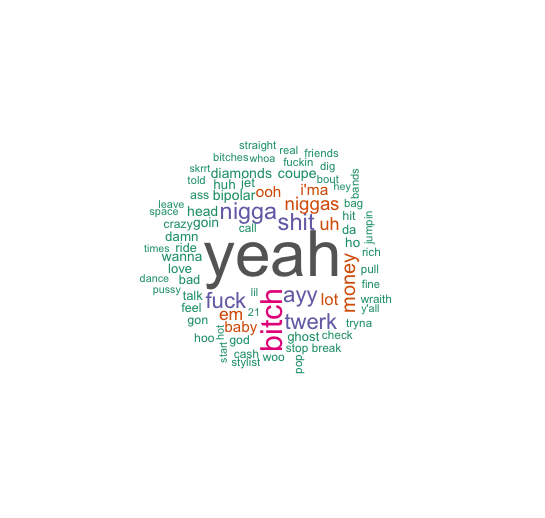

### Pop

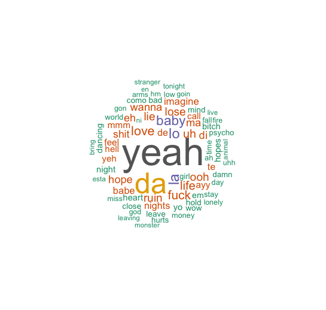

### RnB

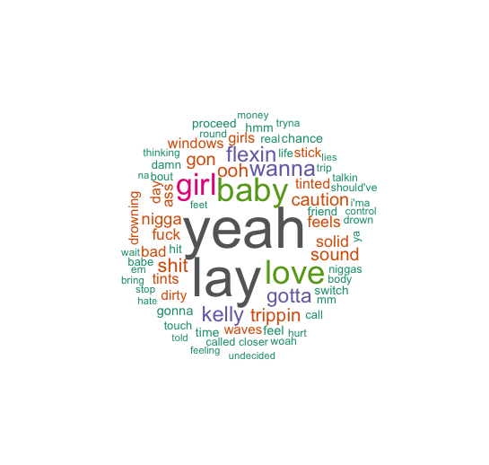

### Country

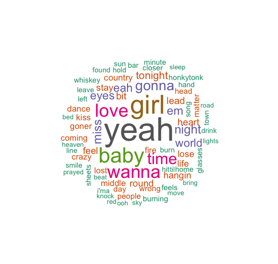

### Classic Rock

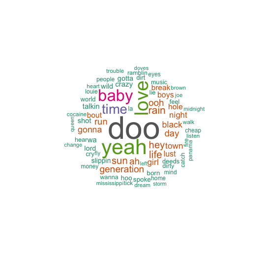

### Metal

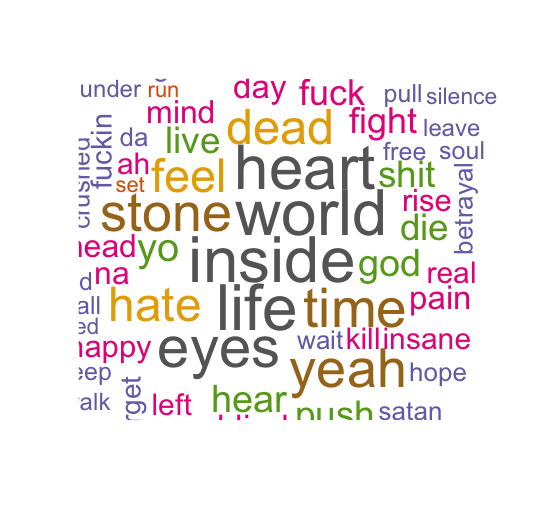

### Rock

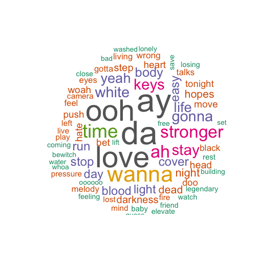

## Lyric Diversity

The first genre test will be which genre has the most diverse word usage. To find this, we will take the number of unique words used for all the songs in a genre and divide it by the number of songs, so that we have an average number of words per song.

```
wordDiversity <- data.frame("rap" = nrow(rapLyricsCount) / nrow(topRap), "pop" = nrow(popLyricsCount) / nrow(topPop), "rnb" = nrow(rnbLyricsCount) / nrow(topRnB), "country" = nrow(countryLyricsCount) / nrow(topCountry), "classicRock" = nrow(classicRockLyricsCount) / nrow(topClassicRock), "metal" = nrow(metalLyricsCount) / nrow(topMetal), "rock" = nrow(rockLyricsCount) / nrow(topRock))
wordDiversity %>%
  gather(key = 'Genre', value = 'Unique Words') -> wordDiversity
```

Again, this is probably a very cumbersome way to do it (a mapping function would probably be most appropriate here), but such is life. Now that we have some more data, let's plot it:

```
ggplot() +
  geom_bar(wordDiversity, mapping = aes(x = Genre, y = `Unique Words`, fill = Genre), stat = 'Identity')
```


NOTE: stop words are taken out (such as "the" and "it"), so the average unique words per song may seem very low.

As expected (or not expected, I don't know what you are expecting), rap by far is the most diverse, with classic rock being the least diverse. The most surprising result, however, is that pop is the third most diverse lyrically, narrowly being edged out by RnB. This could possibly be due to rap features bolstering it (or also likely, rap songs being in the pop playlist). It is also likely that pop as a whole has evolved as a genre and is now just more diverse lyrically, drawing a lot of influence from rap.

## Profanity Usage

That was fun and all, but now we want to look at the explicits: which genre do you not want to play at a family gathering (aka which genre is the most profane)? Before we begin, we need to assemble a list of profanities to look for. To do this, I looked at a wiki page for english swear words (https://en.wiktionary.org/wiki/Category:English_swear_words), copied in the ones that were actually offensive (for instance, "Christ on a cracker"" was omitted), added the plural and past tense versions of ones that had them, and finally stored the profanities in a data frame.

```
profanities <- data.frame(words = c("ass", "asses", "asshole", "assholes", "bastard", "bastards", "bitch", "bitches", "bitching", "bullshit", "cock", "crap", "cunt", "cunts", "damn", "damned", "damnit", "dick", "fuck", "fucked", "fucker", "fucks", "goddamn", "hell", "nigga", "niggas", "shit", "shitty", "shits", "shitted"))
```

Now that we have our profanities, we can join them with our lyric counts to get a count of profanity occurrences:

```
badWordsInMusic <- left_join(profanities, rapLyricsCount) %>%
  left_join(popLyricsCount) %>%
  left_join(rnbLyricsCount) %>%
  left_join(countryLyricsCount) %>%
  left_join(classicRockLyricsCount) %>%
  left_join(metalLyricsCount) %>%
  left_join(rockLyricsCount)
badWordsInMusic[is.na(badWordsInMusic)] <- 0

# make tidy
badWordsInMusic %>%
  gather(key = 'Genre', value = 'Number of Profanities', -words) %>%
  filter(`Number of Profanities` != 0) -> tidyBadWords
```

With our data ready, we can now plot it:

```
substr(tidyBadWords$words, 2, 4) <- "**" # censors the second and third letter, which doesn't really help that much but whatever
ggplot() +
  geom_bar(tidyBadWords, mapping = aes(x = Genre, y = `Number of Profanities`, fill = `words`), stat = "identity")
```

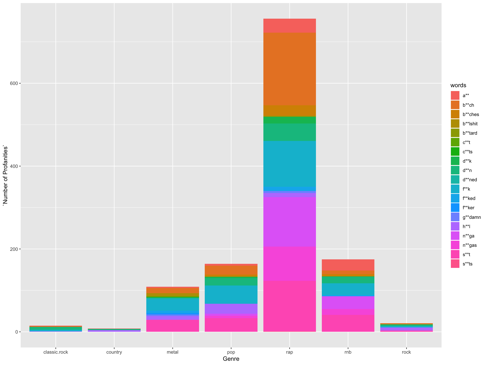

Rap is far and away the most profane, but while this chart has some use in showing distribution of swear words by genre, it is misleading. From before, we saw the rap had the most diverse word usage, which meant it also had the most words per song, so naturally there are going to be more swear words. A more accurate way of depicting this would be showing average number of profanities per song, which can be calculated similarly to the proportion before:

```
badWordsProportion <- data.frame("genre" = c("rap", "pop", "rnb", "country", "classicRock", "metal", "rock"), "proportion" = 0)
badWordsProportion[1, "proportion"] <- sum(badRap$n) / nrow(rapLyrics)
badWordsProportion[2, "proportion"] <- sum(badPop$n) / nrow(popLyrics)
badWordsProportion[3, "proportion"] <- sum(badRnB$n) / nrow(rnbLyrics)
badWordsProportion[4, "proportion"] <- sum(badCountry$n) / nrow(countryLyrics)
badWordsProportion[5, "proportion"] <- sum(badClassicRock$n) / nrow(classicRockLyrics)
badWordsProportion[6, "proportion"] <- sum(badMetal$n) / nrow(metalLyrics)
badWordsProportion[7, "proportion"] <- sum(badRock$n) / nrow(rockLyrics)
```

Now with our new proportions calculated, we can show the graph again, although this time it is without color coding by profanity:

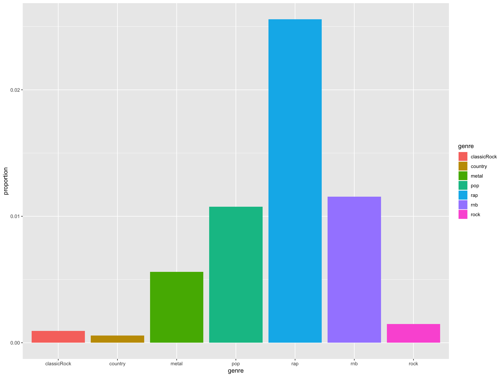

Rap is still the most profane, with just over 2.5% of all lyrics being profanities, but now the gap is not nearly as large. Nothing else in the graph really stands out, as everything shakes out about as expected.

## Drugs: They're Cool

Sex and drugs are the two topics that are very taboo in many households, and also play a big part in why parents don't like certain genres of music. While sex is a much harder trend to find in music, drug references are a fairly straightforward to find and visualize. To do this, we first need to gather a comprehensive list of drug "slang", which we scrape from a website that contains them as table elements, which we can do using the rvest package:

```
drugsURL <- "https://www.therecoveryvillage.com/drug-addiction/street-names-for-drugs/#gref"
drugPage <- read_html(drugsURL)
drugHTML <- html_nodes(drugPage, "li")
drugSlang <- html_text(drugHTML)
drugSlang <- drugSlang[-c(1:229)]
drugSlang <- drugSlang[-c(246:275)]
drugSlang <- append(drugSlang, c("adderall", "cocaine", "medicine", "meth", "ecstasy", "mdma", "heroin", "inhalants", "ketamine", "lsd", "marijuana", "mushrooms", "oxycontin", "ritalin", "vicodin", "xanax", "xan", "pcp"))
drugSlang <- append(drugSlang, c("vodka", "whiskey", "drink", "drank", "rum", "bourbon", "brandy", "cognac", "henny", "hennesey", "beer", "hops", "wine", "liquor", "gin"))
drugSlang <- sapply(drugSlang, tolower)
drugSlang <- data.frame(words = drugSlang)
```

The removed rows from drugSlang are other table items that are not about drugs (HTML sites use lists for things like the menu bar on top or the various links at the bottom of the page, so those got caught up in the web scraper and have to be removed after). Afterwards, the table headers are manually added because those are drug names as well that weren't in the list since they weren't list elements. Finally, alcohol slang is added manually, because for some reason a site for recovering drug addicts don't consider alcohol a drug that is potentially dangerous and may have slang. The dataframe is then lowercased so that it will match up with the lyric data.

Now that the drugSlang dataframe is complete, we can join it with the lyric data into a new dataframe:

```
drugsInMusic <- left_join(drugSlang, rapLyricsCount) %>%
  left_join(popLyricsCount) %>%
  left_join(rnbLyricsCount) %>%
  left_join(countryLyricsCount) %>%
  left_join(classicRockLyricsCount) %>%
  left_join(metalLyricsCount) %>%
  left_join(rockLyricsCount)

drugsInMusic <- drugsInMusic[rowSums(is.na(drugsInMusic)) < 7,] # removes all empty rows
drugsInMusic[is.na(drugsInMusic)] <- 0 # change na's to 0's
```

There are quite a few slang words that matched but probably aren't used as drug references in most of the songs, so those were removed manually:

```
drugsInMusic <- drugsInMusic[!(drugsInMusic$words == "adam" | drugsInMusic$words == "bars" | drugsInMusic$words == "beans" | drugsInMusic$words == "bliss" | drugsInMusic$words == "bloom" | drugsInMusic$words == "blue" | drugsInMusic$words == "bold" | drugsInMusic$words == "boy" | drugsInMusic$words == "buttons" | drugsInMusic$words == "clarity" | drugsInMusic$words == "glad" | drugsInMusic$words == "glass" | drugsInMusic$words == "hog" | drugsInMusic$words == "horse" | drugsInMusic$words == "hug" | drugsInMusic$words == "ice" | drugsInMusic$words == "jet" | drugsInMusic$words == "joker" | drugsInMusic$words == "killers" | drugsInMusic$words == "line" | drugsInMusic$words == "mud" | drugsInMusic$words == "pineapple" | drugsInMusic$words == "purple" | drugsInMusic$words == "robo" | drugsInMusic$words == "rolls" | drugsInMusic$words == "rush" | drugsInMusic$words == "scratch" | drugsInMusic$words == "shards" | drugsInMusic$words == "smack" | drugsInMusic$words == "thunder" | drugsInMusic$words == "velvet" | drugsInMusic$words == "white"),]
```

The last step is to tidy the data and once again remove empty rows:

```
drugsInMusic <- gather(drugsInMusic, key = 'Genre', value = 'Drugs', -words)
drugsInMusic <- drugsInMusic[!(drugsInMusic$Drugs == 0),] # removes all empty rows again
```

Now we can graph a total count again:

```
ggplot() +
  geom_bar(drugsInMusic, mapping = aes(x = Genre, y = Drugs, fill = words), stat = "Identity")
```

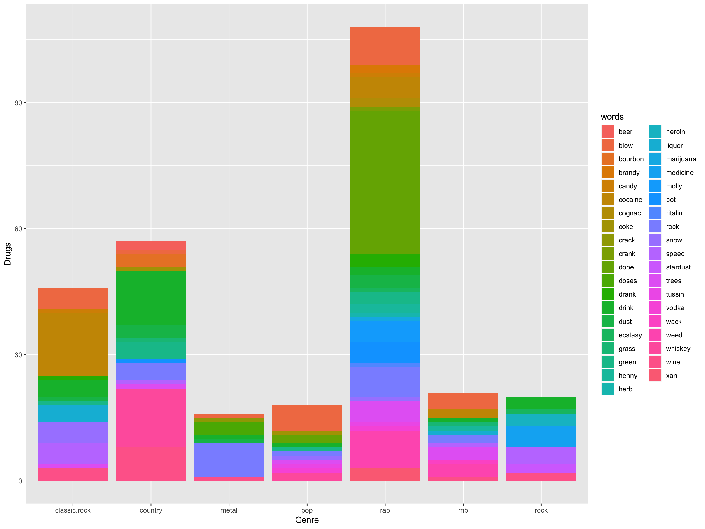

This again visualizes which genres reference which drugs, but is not a fair representation due to the much higher word count of rap songs. A proportion dataframe is calculated again:

```
drugsProportion <- data.frame("Genre" = c("rap", "pop", "rnb", "country", "classicRock", "metal", "rock"), "proportion" = 0)
drugsProportion[1, "Proportion"] <- sum(drugsInMusic$rap) / nrow(rapLyrics)
drugsProportion[2, "Proportion"] <- sum(drugsInMusic$pop) / nrow(popLyrics)
drugsProportion[3, "Proportion"] <- sum(drugsInMusic$rnb) / nrow(rnbLyrics)
drugsProportion[4, "Proportion"] <- sum(drugsInMusic$country) / nrow(countryLyrics)
drugsProportion[5, "Proportion"] <- sum(drugsInMusic$classic.rock) / nrow(classicRockLyrics)
drugsProportion[6, "Proportion"] <- sum(drugsInMusic$metal) / nrow(metalLyrics)
drugsProportion[7, "Proportion"] <- sum(drugsInMusic$rock) / nrow(rockLyrics)
```

Finally, the proportion is graphed:

```
ggplot() +
  geom_bar(drugsProportion, mapping = aes(x = Genre, y = Proportion, fill = Genre), stat = "Identity")
```

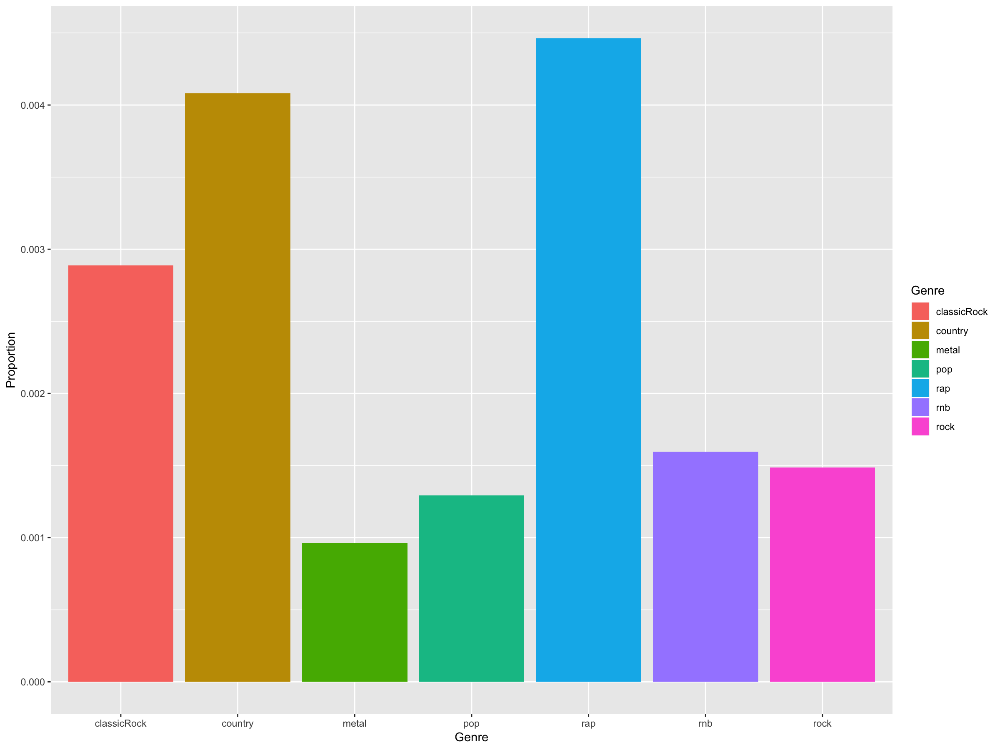

Overall, the drug references are much less common than profanity usage, but the interesting part is looking at country and classic rock. Country trails rap for drug references by a margin of 0.0038%, which is not as small as it looks, but still a fairly small amount. Classic rock is also very high up there, which may be the most surprising. Looking at the count graph, it is easy to see what drugs each genre sings about: rap is big on weed, country sings a lot about alcohol (particularly whiskey), and classic rock sings a lot about cocaine. However, there are some big exceptions that should be noted. 

A HUGE chunk of the rap drug references is dope, which may not necessarily be referring to weed, and would have to be evaluated at a case by case basis. In addition, the classic rock cocaine references are inflated by a song called cocaine, which is where the majority of cocaine references come from. The sample size is fairly small and is hard to make larger inferences using this data.

Anyways, the moral of the story is that if your parents don't want you listening to rap, make sure they aren't playing country around the house either, for one reason or another.